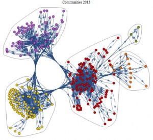

# Multi-Objective-Routing-Problem-with-Constraints-An-Approach-for-Routing-Problems

## Contributor 
This project has been done with Ali Makouar : [git of the contributor](github.com/alimakouar)


## Network Representation

In the context of this project, the operator's network is represented as a directed graph, where each node corresponds to a potential routing point, and each arc represents a connection between these points. Each arc is characterized by a maximum capacity and a routing cost per unit of traffic.

## Project Objectives

The fundamental objective of this project is to define optimal routing paths to satisfy various traffic demands. This optimization must consider three distinct objective functions:

1. **Routing Cost:** Minimize the total routing cost to allocate resources economically.
2. **Maximum Arc Utilization:** Minimize the maximum utilization of each arc for efficient traffic engineering.
3. **Average Arc Utilization:** Ensure balanced average utilization of arcs to improve service quality.

These concurrent objectives will require a systematic approach and the application of linear models to achieve optimal or efficient solutions, according to the operational needs of the network operator.
<div style="text-align:center;">
    
</div>

## Linear Models (Continued)

### Objective 1: Routing Cost

The first objective of the project aims to minimize the total routing cost. To achieve this goal, we formulate a linear objective function that considers the weighted sum of the routing costs of each arc, taking into account associated traffic volumes.

```math
\min \sum_{i \in S} \sum_{j \in S \backslash i} \sum_{a \in A} x_{aij} \cdot t_{ij} \cdot w_{a} \quad \text{(1)}
```

This function seeks to allocate traffic flows to minimize the total network cost, considering specific weights associated with each arc.

### Objective 2: Maximum Arc Utilization

The second objective is to minimize the maximum utilization of each arc, thereby promoting more efficient traffic engineering. The corresponding objective function is formulated as follows:

```math
\min \max_{i \in S} \sum_{j \in S \backslash i} x_{aij} \cdot t_{ij} \quad \text{(2)}
```

This function aims to evenly distribute traffic load across all arcs, favoring balanced usage of the entire network.

### Objective 3: Average Arc Utilization

The third objective is to optimize service quality by minimizing the maximum utilization of arcs. The corresponding objective function is formulated as follows:

```math
\min \sum_{i \in S} \sum_{j \in S \backslash i} \sum_{a \in A} x_{aij} \cdot t_{ij} \cdot \frac{1}{|A|} \quad \text{(3)}
```

This function aims to minimize the maximum utilization of an arc, thereby contributing to a more balanced utilization of network resources.

### Constraints

To ensure the coherence and feasibility of the model, several constraints must be observed:

**Constraint (1):** 

```math
\sum_{a \in \Gamma_{out}(i)} x_{aij} = 1 \quad \forall i \in S, j \in S \backslash \{i\} \quad \text{(4)}
```

This constraint ensures that the sum of outgoing traffic proportions from a node is equal to 1.

**Constraint (2):** 

```math
\sum_{a \in \Gamma_{in}(j)} x_{aij} = 1 \quad \forall i \in S, j \in S \backslash \{i\} \quad \text{(5)}
```

This constraint ensures that the sum of incoming traffic proportions to a node is equal to 1.

**Constraint (3):** 

```math
\sum_{a \in \Gamma_{in}(v)} x_{aij} = \sum_{a \in \Gamma_{out}(v)} x_{aij} \quad \forall i \in S, j \in S \backslash \{i, j\} \quad \text{(6)}
```

This constraint balances the incoming and outgoing flow of each intermediate node.

**Constraint (4):** 

```math
\sum_{i \in S} \sum_{j \in S\backslash\{i\}} x_{aij} \cdot t_{ij} \leq c_{a} \quad \forall a \in A \quad \text{(7)}
```

This constraint imposes that the sum of flows through each arc does not exceed its maximum capacity.
